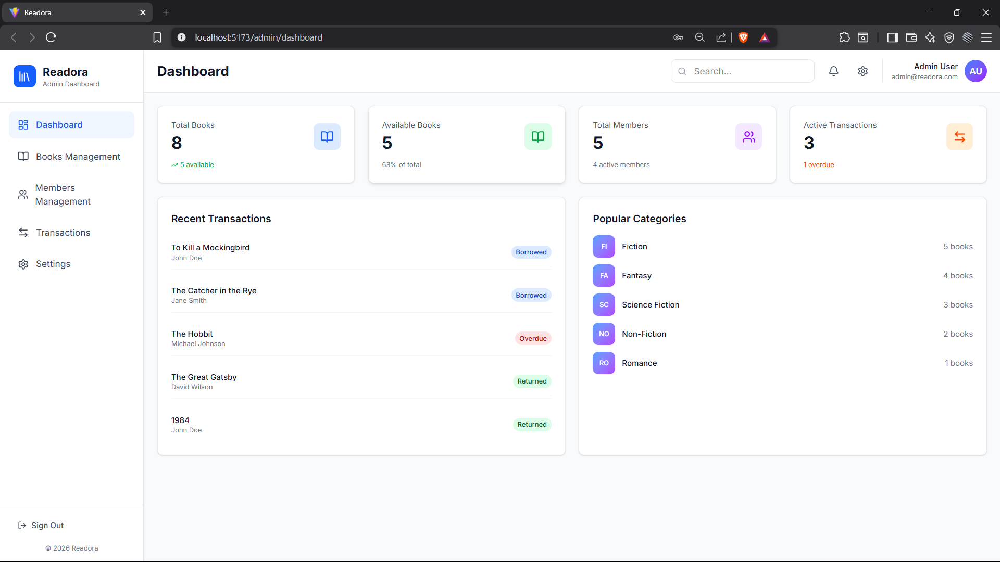
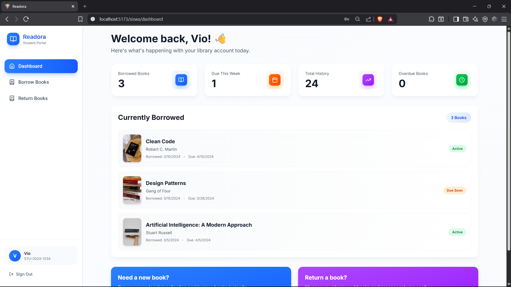

# 📚 Readora-Lib

<div align="center">


[](https://react.dev/)
[](https://vitejs.dev/)
[](https://tailwindcss.com/)
[](https://www.javascript.com/)
[](https://www.typescriptlang.org/)

**A Modern, Scalable Library Management System**

> Comprehensive frontend solution for managing library operations with role-based access control, real-time notifications, and intuitive user experience.

[Features](#-features) • [Tech Stack](#-tech-stack) • [Live Demo](#-live-demo) • [Getting Started](#-getting-started) • [Documentation](#-documentation) • [Contributing](#-contributing)

</div>
---
## 🎯 Overview

**Readora-Lib** is a cutting-edge library management system designed to streamline library operations for both administrators and students. Built with modern web technologies, it provides a seamless experience for managing books, members, and transactions while maintaining robust security through role-based access control.

### Key Highlights

- 🎨 **Modern UI/UX** - Clean, responsive design powered by Tailwind CSS and shadcn/ui
- ⚡ **High Performance** - Optimized build with Vite for lightning-fast development and production builds
- 🔒 **Secure Authentication** - JWT-based authentication with role-specific access control
- 📱 **Responsive Design** - Fully responsive interface for desktop, tablet, and mobile devices
- 🔄 **Real-time Updates** - Instant notifications for all user actions
- 🎯 **Type-Safe** - TypeScript integration for enhanced code quality and developer experience

---
## 📸 Preview

### 🔐 Authentication

#### Login
<div align="center">
  
</div>

#### Register
<div align="center">
  
</div>

---

### 📊 Dashboard

#### 👑 Admin Dashboard
<div align="center">
  
</div>

#### 🎓 Student Dashboard
<div align="center">
  
</div>

---

## ✨ Features

### 🔐 Authentication & Authorization

| Feature | Description |
|---------|-------------|
| **Role-Based Login** | Separate authentication flows for Admin and Siswa (Students) |
| **User Registration** | Self-service registration for new users |
| **Protected Routes** | Dynamic route guards based on user roles |
| **Persistent Sessions** | LocalStorage + Zustand for seamless state persistence |
| **Auto Redirection** | Intelligent role-based dashboard redirection |
| **Secure Logout** | Token invalidation and session cleanup |

### 👨‍💼 Admin Features

| Module | Capabilities |
|--------|--------------|
| **Dashboard** | Comprehensive library overview with key metrics, statistics, and actionable insights |
| **Books Management** | Full CRUD operations for library books with search, filter, and pagination |
| **Members Management** | Complete member lifecycle management (Anggota) |
| **Transactions** | Streamlined book borrowing and returning processes with status tracking |
| **Settings** | Centralized system configuration and preferences management |
| **Analytics** | Data-driven insights into library usage patterns |

### 👨‍🎓 Student (Siswa) Features

| Module | Capabilities |
|--------|--------------|
| **Dashboard** | Personalized overview with quick access to frequently used features |
| **Browse Catalog** | Search and filter available books with detailed information |
| **Borrow Books** | Simple and intuitive book borrowing workflow |
| **History** | Complete borrowing history with status tracking |
| **Profile** | Personal information and active borrowings overview |

---

## 🛠️ Tech Stack

### Core Technologies

```
┌─────────────────────────────────────────────────────────────┐
│  Framework      │ React 19          │ UI Library            │
│  Build Tool     │ Vite 7            │ Dev Server & Bundler  │
│  Language       │ JavaScript/TS     │ Type Safety           │
│  Routing        │ React Router 7    │ Client-side Routing   │
└─────────────────────────────────────────────────────────────┘
```

### Styling & UI

| Technology | Version | Purpose |
|------------|---------|---------|
| **Tailwind CSS** | 4 | Utility-first CSS framework |
| **shadcn/ui** | Latest | Beautifully designed components |
| **Lucide React** | Latest | Icon library |
| **Framer Motion** | Latest | Animation library |

### State Management & Data

| Technology | Version | Purpose |
|------------|---------|---------|
| **Zustand** | 5 | Lightweight state management |
| **Axios** | Latest | HTTP client for API calls |
| **Sonner** | Latest | Toast notification system |

### Development Tools

| Tool | Purpose |
|------|---------|
| **ESLint** | Code quality and consistency |
| **Prettier** | Code formatting |
| **Vite** | Fast build tooling with HMR |

---

## 🚀 Getting Started

### Prerequisites

Ensure you have the following installed:

| Requirement | Version | Download |
|-------------|---------|----------|
| **Node.js** | v18+ | [Download](https://nodejs.org/) |
| **npm/yarn** | Latest | Included with Node.js |
| **Git** | Latest | [Download](https://git-scm.com/) |

### Installation

1. **Clone the repository**

   ```bash
   git clone https://github.com/Alif-Kopling/Readora-Lib.git
   cd Readora-Lib
   ```

2. **Install dependencies**

   ```bash
   npm install
   ```

3. **Configure environment variables**

   Create a `.env` file in the root directory:

   ```env
   # API Configuration
   VITE_API_BASE_URL=http://localhost:8000/api
   
   # Optional: Feature flags
   VITE_ENABLE_MOCK_DATA=false
   ```

4. **Start the development server**

   ```bash
   npm run dev
   ```

   The application will be available at: **http://localhost:5173/**

### Available Scripts

| Command | Description |
|---------|-------------|
| `npm run dev` | Start development server with hot module replacement |
| `npm run build` | Create optimized production bundle |
| `npm run preview` | Preview production build locally |
| `npm run lint` | Run ESLint for code quality analysis |

### Build for Production

```bash
# Create production build
npm run build

# Preview production build
npm run preview
```

The production build will be output to the `dist/` directory.

---

## 📁 Project Structure

```
Readora-Lib/
├── public/                    
│   └── vite.svg
├── src/
│   ├── assets/               
│   ├── components/          
│   │   ├── books/            
│   │   ├── figma/             
│   │   ├── layout/          
│   │   │   ├── Footer.jsx
│   │   │   ├── Layout.tsx
│   │   │   ├── Navbar.jsx
│   │   │   ├── Sidebar.jsx
│   │   │   └── SiswaLayout.tsx
│   │   ├── members/           
│   │   ├── notifications/   
│   │   ├── shared/            
│   │   ├── siswa/             
│   │   └── ui/                
│   │       ├── accordion.tsx
│   │       ├── alert-dialog.tsx
│   │       ├── alert.tsx
│   │       ├── avatar.tsx
│   │       ├── badge.tsx
│   │       ├── button.tsx
│   │       ├── card.tsx
│   │       ├── dialog.tsx
│   │       ├── dropdown-menu.tsx
│   │       ├── form.tsx
│   │       ├── input.tsx
│   │       ├── label.tsx
│   │       ├── modal.tsx
│   │       ├── select.tsx
│   │       ├── table.tsx
│   │       └── tabs.tsx
│   ├── pict-documentation/     
│   ├── router/               
│   │   ├── AppRoutes.jsx      
│   │   └── guards.js            
│   ├── services/               
│   │   ├── endpoints/     
│   │   │   ├── anggotaService.js
│   │   │   └── authService.js
│   │   ├── api.js             
│   │   ├── mockData.ts        
│   │   └── notificationService.ts
│   ├── stores/                 
│   │   ├── auth.js            
│   │   ├── notification.ts    
│   │   └── perpustakaan.js    
│   ├── style/                 
│   ├── types/                
│   ├── utils/                  
│   ├── views/                 
│   │   ├── admin/
│   │   │   ├── Anggota/       
│   │   │   ├── Buku/         
│   │   │   ├── Transaksi/     
│   │   │   ├── Dashboard.tsx
│   │   │   ├── DashboardAdmin.jsx
│   │   │   ├── MembersManagement.tsx
│   │   │   ├── Settings.tsx
│   │   │   └── Transactions.tsx
│   │   ├── auth/              
│   │   │   ├── Login.jsx
│   │   │   └── Register.jsx
│   │   └── siswa/             
│   │       ├── Dashboard.tsx
│   │       ├── PinjamBuku.tsx
│   │       └── Riwayat.tsx
│   ├── App.jsx                 
│   └── main.jsx                
├── .env                   
├── .env.example                
├── .gitignore              
├── index.html             
├── package.json               
├── vite.config.js     
└── README.md                   
```

---

## 🌐 API Integration

### Configuration

API configuration is located in `services/api.js`:

```javascript
import axios from 'axios';
import useAuthStore from '../stores/auth';

const api = axios.create({
  baseURL: import.meta.env.VITE_API_BASE_URL || 'http://localhost:8000/api',
  headers: {
    'Content-Type': 'application/json',
  },
});

// Request interceptor for auth token
api.interceptors.request.use((config) => {
  const token = useAuthStore.getState().token;
  if (token) {
    config.headers.Authorization = `Bearer ${token}`;
  }
  return config;
});

// Response interceptor for error handling
api.interceptors.response.use(
  (response) => response,
  (error) => {
    if (error.response?.status === 401) {
      useAuthStore.getState().logout();
    }
    return Promise.reject(error);
  }
);

export default api;
```

### Available Services

| Service | File | Endpoints |
|---------|------|-----------|
| **Auth Service** | `endpoints/authService.js` | login, register, logout, refreshToken |
| **Anggota Service** | `endpoints/anggotaService.js` | getAll, getById, create, update, delete |

### Usage Example

```javascript
import authService from '../services/endpoints/authService';
import { toast } from 'sonner';

const handleLogin = async (credentials) => {
  try {
    const response = await authService.login(credentials);
    toast.success('Login successful!');
    return response;
  } catch (error) {
    toast.error('Login failed. Please try again.');
    throw error;
  }
};
```

---

---

## 🤝 Contributing

We welcome contributions to Readora-Lib! Here's how you can help:

### How to Contribute

1. **Fork the repository**
   ```bash
   git fork https://github.com/Alif-Kopling/Readora-Lib.git
   ```

2. **Create a feature branch**
   ```bash
   git checkout -b feature/AmazingFeature
   ```

3. **Make your changes**
   - Follow the existing code style
   - Add meaningful comments for complex logic
   - Use descriptive variable and function names

4. **Test your changes**
   ```bash
   npm run lint
   npm run build
   ```

5. **Commit your changes**
   ```bash
   git commit -m 'feat: Add AmazingFeature'
   ```

6. **Push and create a Pull Request**
   ```bash
   git push origin feature/AmazingFeature
   ```

### Development Guidelines

- **Code Style**: Follow ESLint configuration
- **Component Structure**: Use functional components with hooks
- **State Management**: Use Zustand stores for global state
- **API Calls**: Use the centralized API service
- **Styling**: Use Tailwind CSS utility classes
- **TypeScript**: Add type definitions for new features

---

## 👥 Team

| Name | Role | Contributions |
|------|------|---------------|
| **Alif** | Lead Developer | Full-stack development, architecture design |
| **Vio** | Developer | UI/UX implementation, component development |

---

## 📄 License

This project is **private and proprietary**. All rights reserved.

© 2026 Readora-Lib. Unauthorized use, distribution, or reproduction is prohibited.

---

## 📞 Support

For questions, issues, or feature requests, please contact the development team.

---

<div align="center">

**Made with ❤️ by the Readora Team**

Built with [React](https://react.dev/) + [Vite](https://vitejs.dev/) + [Tailwind CSS](https://tailwindcss.com/)

[](https://github.com/Alif-Kopling/Readora-Lib)

</div>
