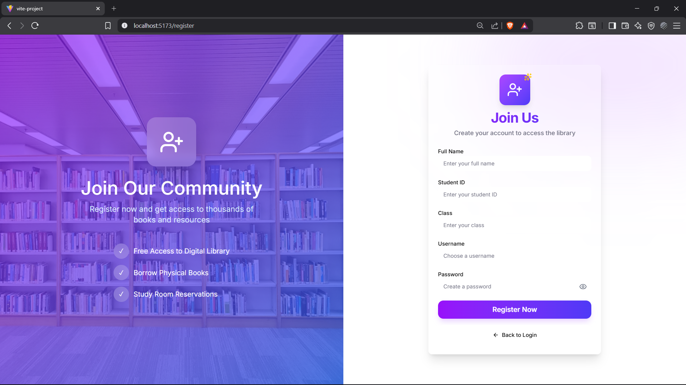
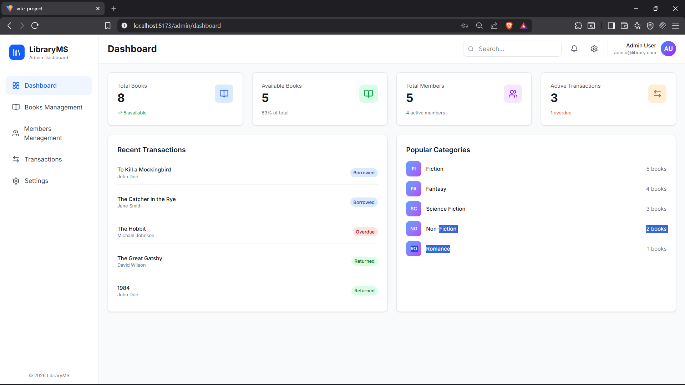

# Readora

Frontend for Readora — Library Management System, built with React, Vite, and a modern component stack.
This project currently focuses on the admin experience and role-based authentication flow.

## Preview






## Highlights

- Role-based login (Admin/Student)
- Admin-protected routes with Zustand auth state
- Admin dashboard modules:
  - Dashboard
  - Books Management
  - Members Management
  - Transactions
  - Settings
- Reusable UI components and responsive layout

## Tech Stack

- React 19 + Vite 7
- JavaScript and TypeScript
- React Router DOM
- Zustand (state management)
- Tailwind CSS
- Lucide React (icons)
- Sonner (toast notifications)

## Getting Started

### 1) Clone repository

```bash
git clone https://github.com/Alif-Kopling/Readora-Lib.git
cd perpustakaan_menegement_FE
```

### 2) Install dependencies

```bash
npm install
```

### 3) Run development server

```bash
npm run dev
```

App runs at: `http://localhost:5173/`

## Scripts

```bash
npm run dev      # Start local dev server
npm run build    # Build production bundle
npm run preview  # Preview production build
npm run lint     # Run lint (requires eslint flat config)
```

## Project Structure

```text
src/
  components/
    layout/
    books/
    members/
    notifications/
    ui/
  router/
    AppRoutes.jsx
    guards.js
  services/
  stores/
  style/
  types/
  views/
    auth/
    admin/
  App.jsx
  main.jsx
```

## Current Auth Flow

- User logs in from `views/auth/Login.jsx`
- Auth data is stored in `stores/auth.js` (Zustand + persist)
- Admin users are redirected to `/admin/dashboard`
- Admin pages are protected in `router/AppRoutes.jsx` using role checks

## Notes

- Student dashboard flow is not fully implemented yet.
- Current login still uses mock token behavior on the frontend.

## Status

Active development on branch `development`.

## Authors

Alif and Vio

